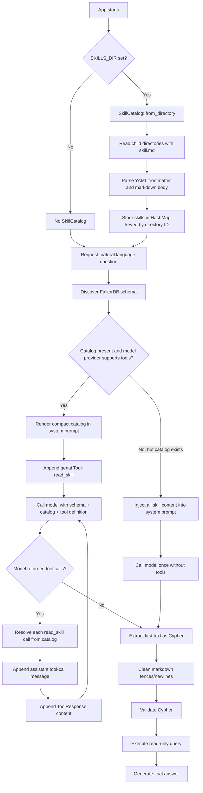
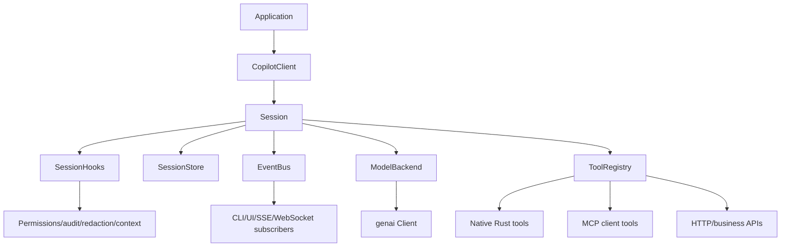
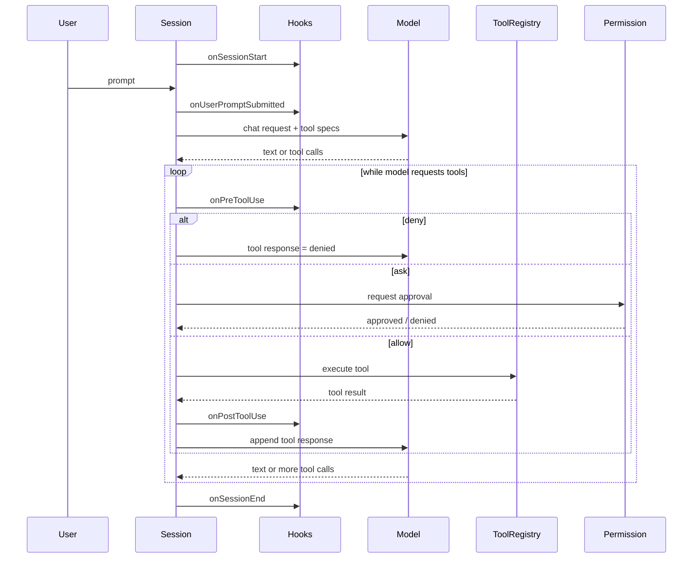

# PR #103: Dynamic Cypher Skills, Model Tool Support, and a Rust Copilot-SDK Strategy

This document explains [FalkorDB/text-to-cypher PR #103](https://github.com/FalkorDB/text-to-cypher/pull/103), how model tool calling is used to enable dynamic skills through the `genai` crate, and how the same design can be extended into a Rust implementation inspired by the GitHub Copilot SDK hooks model.

At the time this was written, PR #103 is open on branch `integrate-cypher-skills` with head SHA `7602e0c098daa93af9b1633d693d5e9a2a37fd96`.

## Executive summary

PR #103 adds a dynamic skill system for FalkorDB Cypher generation. A "skill" is a markdown document with YAML frontmatter that teaches the LLM a specific FalkorDB/Cypher best practice. The PR loads those files at startup or through the library API, exposes a compact skill catalog to the model, and optionally lets tool-capable models call a `read_skill` tool to fetch full skill content only when needed.

The important architecture change is this:

1. The base system prompt still contains static FalkorDB rules, such as read-only constraints, index-aware predicate guidance, full-text/vector search syntax, and parameterized query guidance.
2. PR #103 adds a `{{SKILLS_CATALOG}}` placeholder after those static FalkorDB rules.
3. If a skill catalog exists and the model provider supports tools, only the compact catalog is injected into the prompt and the model may call `read_skill`.
4. If a skill catalog exists but the provider is not considered tool-capable, the full content of every skill is injected into the prompt as a fallback.
5. If no skills are configured, behavior remains effectively unchanged.

This is a good foundation for a Rust Copilot-SDK-like agent runtime because it already contains the core loop every tool-using agent needs:

1. Build a model request with tool definitions.
2. Let the model return text or tool calls.
3. Execute requested tools in host code.
4. Append tool responses back into the conversation.
5. Repeat until the model produces a final answer.

The Copilot SDK hooks feature can be implemented in Rust by adding lifecycle callbacks around this loop: before session start, before prompt submission, before tool execution, after tool execution, on errors, and at session end.

## What changed in PR #103

The PR changes 18 files. The functional changes are concentrated in `src/skills`, `src/core.rs`, `src/processor.rs`, `src/lib.rs`, `src/main.rs`, `src/template.rs`, `templates/system_prompt.txt`, and the setup/docs files.

| File | Purpose |
| --- | --- |
| `src/skills/parser.rs` | Parses `skill.md` files with YAML frontmatter and markdown body. |
| `src/skills/loader.rs` | Loads skill directories under `SKILLS_DIR`. |
| `src/skills/mod.rs` | Defines `SkillCatalog`, renders catalogs/content, builds the `read_skill` tool definition, and gates model provider tool support. |
| `src/core.rs` | Adds `generate_cypher_query_with_skills()` and a non-streaming tool-call loop for query generation. |
| `src/processor.rs` | Adds `process_text_to_cypher_with_skills()` and passes the catalog through query generation and self-healing. |
| `src/lib.rs` | Exports `skills`, `SkillCatalog`, `QueryContext`, and adds `TextToCypherClient::with_skills()`. |
| `src/main.rs` | Loads `SKILLS_DIR` in server config and uses skill-aware query generation in the SSE server path. |
| `src/template.rs` | Adds `render_system_prompt_with_skills()` and collapses extra blank lines when no skills are present. |
| `templates/system_prompt.txt` | Adds `{{SKILLS_CATALOG}}` after the static FalkorDB-specific rules. |
| `Cargo.toml` / `Cargo.lock` | Adds `serde_yaml_ng` for frontmatter parsing and `tempfile` for tests. |
| `Dockerfile` | Adds skill download/build-time support so the image can ship with skills. |
| `justfile` | Adds development recipes for downloading/listing skills and running with skills. |
| `.env.example` | Adds `SKILLS_DIR`. |
| `readme.md` | Documents setup, provider support, library usage, and fallback behavior. |

One small but important implementation note: the PR description calls the loader a recursive scanner, but the code currently scans immediate child directories of `SKILLS_DIR` and looks for `skill.md` inside each child. It does not recursively search arbitrary nested trees.

## What "skills" mean in this PR

The PR uses "skill" in a specific way:

```text
Skill = markdown instructions for the LLM
Tool = model-callable function metadata exposed through genai
read_skill = host-side function that returns a skill's markdown content
```

A skill is not an executable action like "run bash" or "query a database". It is an instruction package. The only new model tool is `read_skill`, and that tool only reads instructional text from an in-memory `SkillCatalog`.

This distinction matters for later Copilot-SDK-style design:

- PR #103 implements a documentation-retrieval tool.
- A Copilot-SDK-like Rust runtime would generalize the same pattern to many host tools: file reads, shell commands, MCP tools, code search, custom business APIs, and so on.

## Skill file format

Each skill is expected to live in a directory whose name becomes the stable skill ID:

```text
skills/
  apply-cypher-limitations/
    skill.md
  use-parameters/
    skill.md
  fulltext-search/
    skill.md
```

Each `skill.md` file contains YAML frontmatter followed by markdown content:

````markdown
---
name: Apply Cypher Limitations
description: Avoid FalkorDB-specific Cypher pitfalls and write optimized queries
---

# Apply Cypher Limitations

## Usage
- The `<>` and `!=` operators are not index-accelerated in FalkorDB.
- Prefer positive predicates when they preserve the user's intent.
- Use `<>` / `!=` only when exclusion is explicitly required.

## Example
Instead of:

```cypher
MATCH (n:Person)
WHERE n.age <> 30
RETURN n
```

Prefer a query shape that can use positive predicates when that preserves intent.
````

The parser only requires:

- `name`
- `description`
- a closing `---` delimiter

Extra YAML fields are ignored by the current parser. Invalid individual skill files are logged and skipped by the loader instead of failing the whole catalog load.

## End-to-end PR flow



## Static prompt vs dynamic skill catalog

The system prompt already contains static FalkorDB rules. In the PR branch, the relevant section looks like this:

```text
FalkorDB-Specific Rules:
1. Not-equal operators (<> and !=) are NOT index-accelerated...
2. Full-text search: If the ontology declares full-text indexes...
3. Vector search: If the ontology declares vector indexes...
4. Parameterized queries: FalkorDB supports the CYPHER keyword prefix...

{{SKILLS_CATALOG}}

Advanced Features Available:
...
```

`TemplateEngine::render_system_prompt_with_skills(ontology, skills_catalog)` fills both placeholders:

- `{{ONTOLOGY}}`
- `{{SKILLS_CATALOG}}`

When `skills_catalog` is empty, the renderer collapses repeated blank lines so the prompt does not gain a visible empty section.

The dynamic part is intentionally placed after static FalkorDB-specific guidance, so the model first sees always-on rules, then the optional skill catalog or full skill content.

## Skill loading internals

The parser creates this Rust struct:

```rust
#[derive(Debug, Clone)]
pub struct Skill {
    pub id: String,
    pub name: String,
    pub description: String,
    pub content: String,
}
```

The loader stores skills in:

```rust
#[derive(Debug, Clone)]
pub struct SkillCatalog {
    pub(crate) skills: HashMap<String, Skill>,
}
```

Important behavior:

- `SkillCatalog::from_directory(path)` calls `loader::load_skills_from_directory(path)`.
- The directory must exist and be a directory.
- Each child directory is inspected for `skill.md`.
- The child directory name becomes the stable ID.
- Missing `skill.md` is skipped.
- Unreadable or invalid individual skills are logged and skipped.
- A successfully loaded empty catalog is possible, but server config stores `None` when the catalog is empty.

The catalog has two rendering modes:

```rust
impl SkillCatalog {
    pub fn render_catalog(&self) -> String {
        // Compact model-facing catalog:
        // Available FalkorDB Cypher Skills ...
        // - apply-cypher-limitations: Avoid FalkorDB pitfalls
    }

    pub fn render_all_content(&self) -> String {
        // Fallback mode:
        // FalkorDB Cypher Skills:
        //
        // ### Skill Name
        // full markdown body...
    }
}
```

## Model tool support in PR #103

Tool support is gated by `skills::supports_tool_calling(model)`.

The function is provider-oriented, not a deep model capability probe. It decides from the model string and `genai::adapter::AdapterKind`.

Supported adapters in the PR:

| Provider adapter | PR behavior |
| --- | --- |
| `OpenAI` | Use `read_skill` tool. |
| `OpenAIResp` | Use `read_skill` tool. |
| `Anthropic` | Use `read_skill` tool. |
| `Gemini` | Use `read_skill` tool. |
| `Xai` | Use `read_skill` tool. |
| `DeepSeek` | Use `read_skill` tool. |
| `Groq` | Fallback to full prompt injection. |
| `Ollama` | Fallback to full prompt injection. |
| `Cohere` | Fallback to full prompt injection. |

The implementation handles two naming styles:

```rust
pub fn supports_tool_calling(model: &str) -> bool {
    use genai::adapter::AdapterKind;

    if let Some((prefix, _)) = model.split_once(':') {
        if let Some(kind) = AdapterKind::from_lower_str(prefix) {
            return is_tool_capable_adapter(kind);
        }
    }

    AdapterKind::from_model(model).is_ok_and(is_tool_capable_adapter)
}
```

The explicit single-colon split is important. `genai` 0.5.3 uses `::` as its model namespace separator internally. Many users still pass models like `openai:gpt-4o` or `anthropic:claude-3-sonnet`. If the PR passed those directly to `AdapterKind::from_model()`, unknown patterns could fall back to the Ollama adapter and incorrectly disable tool support.

### What "model tool support" really means

There are two layers:

1. The provider adapter must be able to serialize tool definitions and parse tool calls.
2. The concrete model must reliably choose and emit tool calls.

PR #103 only gates the first layer. Even for providers marked supported, individual model behavior can vary:

- Some models may over-call `read_skill`.
- Some may ignore available tools.
- Some may call a tool with malformed arguments.
- Some providers may support tools only for certain model families.

The fallback path guarantees that unsupported providers still receive skill content, but at the cost of larger prompts.

## How `genai` is used for tools

PR #103 uses `genai` 0.5.3. In this version, tool definitions are part of `genai::chat::ChatRequest`, not `ChatOptions`.

Relevant `genai` types:

```rust
pub struct ChatRequest {
    pub system: Option<String>,
    pub messages: Vec<ChatMessage>,
    pub tools: Option<Vec<Tool>>,
}

pub struct Tool {
    pub name: String,
    pub description: Option<String>,
    pub schema: Option<serde_json::Value>,
    pub config: Option<serde_json::Value>,
}

pub struct ToolCall {
    pub call_id: String,
    pub fn_name: String,
    pub fn_arguments: serde_json::Value,
    pub thought_signatures: Option<Vec<String>>,
}

pub struct ToolResponse {
    pub call_id: String,
    pub content: String,
}
```

`ChatOptions` has useful streaming capture flags such as `capture_tool_calls`, but PR #103's non-streaming query generation path does not use `ChatOptions` to define tools. It appends tools directly to `ChatRequest`.

There is also no explicit `tool_choice` field in `genai` 0.5.3 `ChatOptions`. The PR therefore does not force `read_skill`; it lets the model decide when to call it.

### Building the `read_skill` tool definition

`SkillCatalog::tool_definition()` creates a `genai::chat::Tool`:

```rust
use genai::chat::Tool;
use serde_json::json;

pub fn tool_definition(&self) -> Tool {
    let ids = self.skill_ids();

    Tool::new("read_skill")
        .with_description(
            "Load the full content of a FalkorDB Cypher skill by its ID. \
             Call this when you need detailed instructions, examples, or syntax \
             for a specific skill listed in the catalog.",
        )
        .with_schema(json!({
            "type": "object",
            "properties": {
                "id": {
                    "type": "string",
                    "description": "The skill ID from the catalog",
                    "enum": ids,
                }
            },
            "required": ["id"],
        }))
}
```

The JSON Schema enum is a strong prompt-level constraint: the model is told exactly which skill IDs are valid. It is not a security boundary. The host still checks the ID during tool resolution.

### Building the model request

The skill-aware request builder:

1. Converts project `ChatRequest` messages into `genai::chat::ChatMessage`.
2. Applies special prompt wrapping to the last user message.
3. Chooses compact catalog vs full skill content.
4. Renders the system prompt.
5. Later appends the tool definition if tool mode is enabled.

Simplified:

```rust
let use_tools =
    skill_catalog.is_some_and(|c| !c.is_empty()) &&
    skills::supports_tool_calling(model);

let skills_text = match skill_catalog {
    Some(catalog) if !catalog.is_empty() => {
        if use_tools {
            catalog.render_catalog()
        } else {
            catalog.render_all_content()
        }
    }
    _ => String::new(),
};

let mut genai_request = genai::chat::ChatRequest::default()
    .with_system(TemplateEngine::render_system_prompt_with_skills(
        ontology,
        &skills_text,
    ));

if use_tools {
    if let Some(catalog) = skill_catalog {
        genai_request = genai_request.append_tool(catalog.tool_definition());
    }
}
```

### Handling the tool-call loop

The core loop in `src/core.rs` is the most important part of the PR:

```rust
const MAX_TOOL_ROUNDS: usize = 3;

for _round in 0..MAX_TOOL_ROUNDS {
    let chat_response = client
        .exec_chat(model, genai_chat_request.clone(), None)
        .await?;

    let tool_calls = chat_response
        .tool_calls()
        .into_iter()
        .cloned()
        .collect::<Vec<_>>();

    if tool_calls.is_empty() {
        let query = chat_response
            .into_first_text()
            .unwrap_or_else(|| "NO ANSWER".to_string());
        return validate_generated_query(&query);
    }

    genai_chat_request =
        genai_chat_request.append_message(GenAiChatMessage::from(tool_calls.clone()));

    for tc in &tool_calls {
        let content = resolve_skill_tool_call(tc, skill_catalog);
        genai_chat_request = genai_chat_request.append_message(
            GenAiChatMessage::from(ToolResponse::new(&tc.call_id, content)),
        );
    }
}
```

This loop is a generic agent loop in miniature:

1. Call model.
2. If response is final text, return it.
3. If response contains tool calls, execute them.
4. Append both the assistant tool-call turn and the tool response turn.
5. Call model again with the expanded conversation.

The assistant tool-call message is required because most tool-calling APIs expect the conversation to include the assistant's requested function calls before the corresponding tool results. `genai` provides `ChatMessage::from(Vec<ToolCall>)` and `ChatMessage::from(ToolResponse)` for this.

### Resolving `read_skill`

The host implementation is simple:

```rust
fn resolve_skill_tool_call(tc: &ToolCall, catalog: Option<&SkillCatalog>) -> String {
    if tc.fn_name != "read_skill" {
        return format!("Unknown tool: {}", tc.fn_name);
    }

    let skill_id = tc.fn_arguments
        .get("id")
        .and_then(|v| v.as_str())
        .unwrap_or("");

    catalog
        .and_then(|c| c.get_skill(skill_id))
        .map_or_else(
            || format!("Skill '{skill_id}' not found in catalog"),
            |s| format!("# {}\n\n{}", s.name, s.content),
        )
}
```

Important details:

- Unknown tool names return text saying the tool is unknown.
- Missing or malformed `id` becomes an empty string and then returns "not found".
- The tool result is markdown text, not structured JSON.
- The tool response is correlated by `tc.call_id`, not by function name.

For a general Copilot-SDK-like tool runtime, this should become a typed registry with validation, permission checks, and explicit error objects.

## Server and library API changes

### Server

`src/main.rs` adds `skill_catalog: Option<SkillCatalog>` to `AppConfig`.

At startup:

```rust
let skill_catalog = std::env::var("SKILLS_DIR").ok().and_then(|dir| {
    let path = std::path::Path::new(&dir);
    match SkillCatalog::from_directory(path) {
        Ok(catalog) if !catalog.is_empty() => Some(catalog),
        Ok(_) => None,
        Err(e) => {
            tracing::warn!("Failed to load skills from {dir}: {e}");
            None
        }
    }
});
```

The server query path uses:

```rust
let skill_catalog = AppConfig::get().skill_catalog.as_ref();
let query = execute_chat_with_skills(
    client,
    model,
    &request.chat_request,
    schema,
    skill_catalog,
    tx,
).await;
```

The server version also sends an SSE status update when skills are being loaded:

```rust
Progress::Status(format!(
    "Loading {} skill(s) for query generation...",
    tool_calls.len(),
))
```

### Library

`TextToCypherClient` gains:

```rust
pub struct TextToCypherClient {
    model: String,
    api_key: String,
    falkordb_connection: String,
    skill_catalog: Option<SkillCatalog>,
}

impl TextToCypherClient {
    #[must_use]
    pub fn with_skills(mut self, catalog: SkillCatalog) -> Self {
        self.skill_catalog = Some(catalog);
        self
    }
}
```

Both `text_to_cypher()` and `cypher_only()` pass `self.skill_catalog.as_ref()` into `processor::process_text_to_cypher_with_skills()`.

Example:

```rust
use std::path::Path;
use text_to_cypher::{ChatMessage, ChatRequest, ChatRole, SkillCatalog, TextToCypherClient};

#[tokio::main]
async fn main() -> Result<(), Box<dyn std::error::Error + Send + Sync>> {
    let catalog = SkillCatalog::from_directory(Path::new("./skills"))?;

    let client = TextToCypherClient::new(
        "openai:gpt-4o-mini",
        "your-api-key",
        "falkor://127.0.0.1:6379",
    )
    .with_skills(catalog);

    let request = ChatRequest {
        messages: vec![ChatMessage {
            role: ChatRole::User,
            content: "Find people older than 30 who are not named John".to_string(),
        }],
    };

    let response = client.cypher_only("social", request).await?;
    println!("{}", response.cypher_query.unwrap_or_default());
    Ok(())
}
```

## What PR #103 can and cannot do

### It can

- Load plain markdown skill files at runtime.
- Keep base prompts small for tool-capable providers.
- Give every provider access to skills by falling back to full prompt injection.
- Improve FalkorDB-specific Cypher generation without hard-coding every detail in Rust.
- Work through the existing library API with `with_skills()`.
- Work through the server by setting `SKILLS_DIR`.
- Reuse skills during initial generation and self-healing retries.

### It cannot

- Guarantee the model will call `read_skill` at the right time.
- Force a specific tool call with `genai` 0.5.3.
- Verify that a provider's specific model actually supports tools beyond the adapter-level gate.
- Validate tool arguments with a JSON Schema validator at runtime.
- Execute arbitrary tools; it only implements `read_skill`.
- Stream query-generation tool calls in the same way it streams final answer text.
- Recursively scan nested skill folders beyond immediate child directories.
- Discover graph index metadata; full-text/vector instructions are only safe when the ontology explicitly declares those indexes.

## Applying this to a Rust Copilot-SDK-like implementation

The Copilot SDK hook model is a session runtime with lifecycle callbacks. PR #103 already implements the central model/tool loop. To build a Rust equivalent, generalize `read_skill` into a `ToolRegistry` and add hook invocations around every stage.

## Copilot SDK hook lifecycle

The hooks documented by the Copilot SDK are:

| Hook | When it fires | Typical use |
| --- | --- | --- |
| `onSessionStart` | Session begins or resumes | Add context, load preferences, modify config. |
| `onUserPromptSubmitted` | User sends a message | Rewrite prompt, add context, reject/filter input. |
| `onPreToolUse` | Before a tool executes | Allow, deny, ask, modify args, add context. |
| `onPostToolUse` | After a tool returns | Transform result, redact secrets, audit, suppress output. |
| `onSessionEnd` | Session ends | Cleanup, metrics, state persistence. |
| `onErrorOccurred` | Model/tool/system error | Retry, skip, abort, notify, log. |

In Rust, those hooks should be strongly typed, async, optional, and scoped to a session ID.

## Rust agent runtime architecture



A minimal crate layout could look like:

```text
src/
  client.rs          # CopilotClient
  session.rs         # Session state and run loop
  hooks.rs           # Hook traits, inputs, outputs
  tools.rs           # Tool trait, ToolRegistry, ToolResult
  model.rs           # ModelBackend trait and GenAiBackend
  events.rs          # SessionEvent enum and event bus
  permissions.rs     # Permission requests and responses
  store.rs           # Session persistence
  mcp.rs             # MCP client bridge
```

## Core Rust types for hooks

One ergonomic approach is a struct of optional boxed async callbacks. Because async closures in trait objects are still awkward, use boxed futures or `async-trait`.

Example with boxed futures:

```rust
use std::{future::Future, pin::Pin, sync::Arc};

pub type BoxFuture<T> = Pin<Box<dyn Future<Output = T> + Send>>;

#[derive(Clone, Debug)]
pub struct HookInvocation {
    pub session_id: String,
}

pub type HookResult<T> = Result<Option<T>, HookError>;

#[derive(Default, Clone)]
pub struct SessionHooks {
    pub on_session_start: Option<Arc<
        dyn Fn(SessionStartHookInput, HookInvocation) -> BoxFuture<HookResult<SessionStartHookOutput>>
            + Send
            + Sync,
    >>,
    pub on_user_prompt_submitted: Option<Arc<
        dyn Fn(UserPromptSubmittedHookInput, HookInvocation) -> BoxFuture<HookResult<UserPromptSubmittedHookOutput>>
            + Send
            + Sync,
    >>,
    pub on_pre_tool_use: Option<Arc<
        dyn Fn(PreToolUseHookInput, HookInvocation) -> BoxFuture<HookResult<PreToolUseHookOutput>>
            + Send
            + Sync,
    >>,
    pub on_post_tool_use: Option<Arc<
        dyn Fn(PostToolUseHookInput, HookInvocation) -> BoxFuture<HookResult<PostToolUseHookOutput>>
            + Send
            + Sync,
    >>,
    pub on_error_occurred: Option<Arc<
        dyn Fn(ErrorOccurredHookInput, HookInvocation) -> BoxFuture<HookResult<ErrorOccurredHookOutput>>
            + Send
            + Sync,
    >>,
    pub on_session_end: Option<Arc<
        dyn Fn(SessionEndHookInput, HookInvocation) -> BoxFuture<HookResult<SessionEndHookOutput>>
            + Send
            + Sync,
    >>,
}
```

For public API ergonomics, a builder can hide the `Arc` and boxed future ceremony:

```rust
let hooks = SessionHooks::builder()
    .on_pre_tool_use(|input, _invocation| async move {
        if input.tool_name == "bash" {
            return Ok(Some(PreToolUseHookOutput::deny(
                "Shell access is not allowed in this session",
            )));
        }
        Ok(Some(PreToolUseHookOutput::allow()))
    })
    .on_post_tool_use(|input, _invocation| async move {
        Ok(redact_secrets(input.tool_result).map(|modified| {
            PostToolUseHookOutput {
                modified_result: Some(modified),
                ..Default::default()
            }
        }))
    })
    .build();
```

## Hook input and output types

These should mirror the Copilot SDK docs but use Rust enums where possible:

```rust
use serde::{Deserialize, Serialize};
use serde_json::Value;

#[derive(Debug, Clone, Serialize, Deserialize)]
pub enum PermissionDecision {
    Allow,
    Deny,
    Ask,
}

#[derive(Debug, Clone, Serialize, Deserialize)]
pub struct PreToolUseHookInput {
    pub timestamp_ms: u64,
    pub cwd: String,
    pub tool_name: String,
    pub tool_args: Value,
}

#[derive(Debug, Clone, Default, Serialize, Deserialize)]
pub struct PreToolUseHookOutput {
    pub permission_decision: Option<PermissionDecision>,
    pub permission_decision_reason: Option<String>,
    pub modified_args: Option<Value>,
    pub additional_context: Option<String>,
    pub suppress_output: bool,
}

impl PreToolUseHookOutput {
    pub fn allow() -> Self {
        Self {
            permission_decision: Some(PermissionDecision::Allow),
            ..Self::default()
        }
    }

    pub fn deny(reason: impl Into<String>) -> Self {
        Self {
            permission_decision: Some(PermissionDecision::Deny),
            permission_decision_reason: Some(reason.into()),
            ..Self::default()
        }
    }
}
```

Use `serde_json::Value` at the hook boundary because tools are dynamically chosen by the model. Inside each tool, deserialize to a typed Rust struct.

## Tool trait and registry

PR #103 hard-codes `read_skill`. A Copilot-SDK-like runtime needs a registry:

```rust
use async_trait::async_trait;
use serde_json::Value;

#[derive(Debug, Clone)]
pub struct ToolSpec {
    pub name: String,
    pub description: String,
    pub schema: Value,
}

#[derive(Debug, Clone)]
pub struct ToolResult {
    pub content: String,
    pub detailed_content: Option<String>,
    pub metadata: Value,
}

#[async_trait]
pub trait AgentTool: Send + Sync {
    fn spec(&self) -> ToolSpec;

    async fn call(&self, args: Value, context: ToolContext) -> Result<ToolResult, ToolError>;
}

pub struct ToolRegistry {
    tools: std::collections::HashMap<String, std::sync::Arc<dyn AgentTool>>,
}

impl ToolRegistry {
    pub fn genai_tools(&self) -> Vec<genai::chat::Tool> {
        self.tools
            .values()
            .map(|tool| {
                let spec = tool.spec();
                genai::chat::Tool::new(spec.name)
                    .with_description(spec.description)
                    .with_schema(spec.schema)
            })
            .collect()
    }

    pub async fn call(
        &self,
        name: &str,
        args: Value,
        context: ToolContext,
    ) -> Result<ToolResult, ToolError> {
        let tool = self
            .tools
            .get(name)
            .ok_or_else(|| ToolError::UnknownTool(name.to_string()))?;
        tool.call(args, context).await
    }
}
```

Then `read_skill` becomes one normal tool:

```rust
use serde::Deserialize;
use serde_json::json;

#[derive(Clone)]
pub struct ReadSkillTool {
    catalog: SkillCatalog,
}

#[derive(Deserialize)]
struct ReadSkillArgs {
    id: String,
}

#[async_trait::async_trait]
impl AgentTool for ReadSkillTool {
    fn spec(&self) -> ToolSpec {
        ToolSpec {
            name: "read_skill".to_string(),
            description: "Load full markdown content for a named Cypher skill.".to_string(),
            schema: json!({
                "type": "object",
                "properties": {
                    "id": {
                        "type": "string",
                        "enum": self.catalog.skill_ids(),
                    }
                },
                "required": ["id"],
            }),
        }
    }

    async fn call(&self, args: serde_json::Value, _context: ToolContext) -> Result<ToolResult, ToolError> {
        let args: ReadSkillArgs = serde_json::from_value(args)?;
        let skill = self
            .catalog
            .get_skill(&args.id)
            .ok_or_else(|| ToolError::InvalidArgs(format!("unknown skill id: {}", args.id)))?;

        Ok(ToolResult {
            content: format!("# {}\n\n{}", skill.name, skill.content),
            detailed_content: None,
            metadata: serde_json::Value::Null,
        })
    }
}
```

## Tool schemas with `schemars`

Manual JSON Schemas are easy to get wrong. For a larger SDK-like runtime, derive schemas from Rust argument types:

```rust
use schemars::{JsonSchema, schema_for};
use serde::Deserialize;

#[derive(Debug, Deserialize, JsonSchema)]
#[serde(deny_unknown_fields)]
struct BashArgs {
    command: String,
    timeout_ms: Option<u64>,
}

fn bash_schema() -> serde_json::Value {
    serde_json::to_value(schema_for!(BashArgs)).expect("schema is serializable")
}
```

Recommended pattern:

- Use `serde` for runtime deserialization.
- Use `schemars` for tool parameter schemas.
- Use `jsonschema` for runtime validation before deserializing if you want user-facing validation errors.
- Use `#[serde(deny_unknown_fields)]` on high-risk tools.

## Session run loop with hooks

The generic loop is PR #103 plus hook calls:



Illustrative Rust:

```rust
pub async fn run_turn(&mut self, prompt: String) -> Result<AssistantMessage, SessionError> {
    let invocation = HookInvocation {
        session_id: self.id.clone(),
    };

    let prompt_input = UserPromptSubmittedHookInput {
        timestamp_ms: now_ms(),
        cwd: self.cwd.display().to_string(),
        prompt,
    };
    let original_prompt = prompt_input.prompt.clone();

    let prompt_output = self
        .hooks
        .on_user_prompt_submitted(prompt_input, invocation.clone())
        .await?;

    let prompt = prompt_output
        .as_ref()
        .and_then(|o| o.modified_prompt.clone())
        .unwrap_or(original_prompt);

    self.messages.push(ChatMessage::user(prompt));

    if let Some(context) = prompt_output.and_then(|o| o.additional_context) {
        self.messages.push(ChatMessage::system(context));
    }

    let mut request = self.build_genai_request();
    request = request.with_tools(self.tools.genai_tools());

    for _round in 0..self.config.max_tool_rounds {
        let response = self.model.exec_chat(&self.config.model, request.clone()).await?;
        let tool_calls = response.tool_calls().into_iter().cloned().collect::<Vec<_>>();

        if tool_calls.is_empty() {
            return Ok(AssistantMessage::from_model_response(response));
        }

        request = request.append_message(genai::chat::ChatMessage::from(tool_calls.clone()));

        for call in tool_calls {
            let result = self.execute_tool_call_with_hooks(call, invocation.clone()).await?;
            request = request.append_message(genai::chat::ChatMessage::from(
                genai::chat::ToolResponse::new(&result.call_id, result.content),
            ));
        }
    }

    Err(SessionError::TooManyToolRounds)
}
```

Tool execution with hooks:

```rust
async fn execute_tool_call_with_hooks(
    &self,
    call: genai::chat::ToolCall,
    invocation: HookInvocation,
) -> Result<ToolExecutionForModel, SessionError> {
    let pre = self
        .hooks
        .on_pre_tool_use(
            PreToolUseHookInput {
                timestamp_ms: now_ms(),
                cwd: self.cwd.display().to_string(),
                tool_name: call.fn_name.clone(),
                tool_args: call.fn_arguments.clone(),
            },
            invocation.clone(),
        )
        .await?;

    let decision = pre
        .as_ref()
        .and_then(|o| o.permission_decision.clone())
        .unwrap_or(PermissionDecision::Allow);

    if matches!(decision, PermissionDecision::Deny) {
        return Ok(ToolExecutionForModel {
            call_id: call.call_id,
            content: pre
                .and_then(|o| o.permission_decision_reason)
                .unwrap_or_else(|| "Tool call denied".to_string()),
        });
    }

    if matches!(decision, PermissionDecision::Ask) {
        let approved = self.permission_handler.ask(&call).await?;
        if !approved {
            return Ok(ToolExecutionForModel {
                call_id: call.call_id,
                content: "Tool call denied by user".to_string(),
            });
        }
    }

    let args = pre
        .as_ref()
        .and_then(|o| o.modified_args.clone())
        .unwrap_or_else(|| call.fn_arguments.clone());

    let tool_result = self
        .tools
        .call(&call.fn_name, args, self.tool_context())
        .await?;

    let post = self
        .hooks
        .on_post_tool_use(
            PostToolUseHookInput {
                timestamp_ms: now_ms(),
                cwd: self.cwd.display().to_string(),
                tool_name: call.fn_name,
                tool_args: call.fn_arguments,
                tool_result: serde_json::to_value(&tool_result.content)?,
            },
            invocation,
        )
        .await?;

    let content = post
        .and_then(|o| o.modified_result)
        .and_then(|v| v.as_str().map(ToOwned::to_owned))
        .unwrap_or(tool_result.content);

    Ok(ToolExecutionForModel {
        call_id: call.call_id,
        content,
    })
}
```

## Strategy for each Copilot-SDK-like feature

| Feature | Rust implementation strategy |
| --- | --- |
| `CopilotClient` | Thin owner of global config, model backend, auth, and default tool factories. |
| `createSession` | Create a `Session` with ID, cwd, hooks, permission handler, tool registry, event bus, and message store. |
| `resumeSession` | Load persisted messages/events/config from `SessionStore`, then call `onSessionStart` with source `resume`. |
| `send(prompt)` | Run `onUserPromptSubmitted`, append prompt/context, call model/tool loop, emit events. |
| Streaming events | Define a `SessionEvent` enum and publish over `tokio::sync::broadcast`; expose CLI callbacks, SSE, or WebSocket adapters. |
| `onSessionStart` | Run before first prompt or immediately after resume; merge `additional_context` into system messages and apply safe config changes. |
| `onUserPromptSubmitted` | Allow prompt rewrite, context injection, length limits, content filtering, or rate limiting. |
| `onPreToolUse` | Run after model emits a tool call but before host execution; implement permissions, argument rewriting, policy, and audit. |
| `onPostToolUse` | Run after host execution but before result goes back to the model; implement redaction, truncation, audit, and result shaping. |
| `onErrorOccurred` | Wrap model calls and tool calls; return retry/skip/abort decisions; integrate with retry budget. |
| `onSessionEnd` | Flush logs, summarize, persist state, close child processes, remove temp files. |
| `onPermissionRequest` | Use an async callback or channel. CLI can prompt; server can emit `permission.requested` event and await response. |
| Custom tools | Implement `AgentTool`; derive schemas with `schemars`; validate args; register as `genai::chat::Tool`. |
| MCP tools | Use `rust-mcp-sdk` or `tower-mcp` to list remote MCP tools and adapt each to `AgentTool`. |
| Built-in file tools | Use `ignore`, `globset`, `walkdir`, `grep-searcher`, and path normalization; enforce allowed roots in `onPreToolUse`. |
| Shell tool | Use `tokio::process::Command`; always run through permission/policy hooks; support timeout and streaming output. |
| Sub-agents | Model each sub-agent as a nested `Session` with parent tool call ID and constrained tools/context. |
| Audit log | Subscribe to events and/or implement hooks; persist JSONL with session ID and event IDs. |
| Context compaction | Track approximate tokens, summarize older messages through a model call, emit compaction events. |
| Model abstraction | Start with `genai` for multi-provider chat/tools; define a `ModelBackend` trait to swap in `async-openai` or `rig`. |
| Tool-result truncation | Implement as default `onPostToolUse` middleware or a `tower` layer around tool services. |
| Provider-specific behavior | Keep provider adapters behind `ModelBackend`; expose capabilities such as `supports_tools`, `supports_streaming_tools`, and `supports_reasoning`. |

## What can be implemented in Rust

A Rust implementation can realistically support:

1. In-process sessions with lifecycle hooks.
2. Async hook callbacks.
3. Permission decisions: allow, deny, ask.
4. Prompt rewriting and context injection.
5. Tool argument modification.
6. Tool result modification, redaction, truncation, and suppression.
7. Custom host tools.
8. MCP-backed tools.
9. Model tool calling through `genai` for supported providers.
10. Fallback prompt injection for non-tool providers.
11. SSE/WebSocket/CLI event streams.
12. Persistent session logs.
13. Basic resume.
14. Metrics and audit trails.
15. Multi-agent orchestration as nested sessions.

Rust is especially strong for:

- typed tool arguments,
- explicit error handling,
- policy enforcement,
- secure path handling,
- async concurrency,
- embedding SDK logic into servers or CLIs,
- running the same hooks in native, server, and CLI contexts.

## What cannot be fully implemented without GitHub's platform

A Rust crate can mimic the Copilot SDK shape, but it cannot reproduce every official Copilot capability unless GitHub exposes the underlying service/protocol and the implementation complies with those terms.

Not realistically implementable as an independent crate:

1. Official GitHub Copilot authentication and entitlement checks.
2. GitHub Copilot quota, billing, and premium request accounting.
3. Proprietary Copilot model routing and service-side policies.
4. Exact Copilot CLI or IDE trust UX.
5. GitHub's internal telemetry correlation and CAPI interaction IDs.
6. Encrypted reasoning payload semantics from proprietary service layers.
7. Exact persisted event log compatibility if the format is not public and stable.
8. Enterprise policy enforcement that depends on GitHub organization settings.
9. Official Copilot-managed tool sandboxing unless exposed by the platform.
10. Identical behavior for built-in GitHub tools such as code search over private repos unless authenticated APIs and permissions are integrated.

Hard but possible with extra infrastructure:

| Capability | Why hard | Possible strategy |
| --- | --- | --- |
| Safe shell execution | Requires OS-level isolation, timeouts, path controls, and user approval. | Use containers, restricted users, timeouts, allow-lists, and `onPreToolUse`. |
| Dynamic third-party plugins | Loading arbitrary native code is risky. | Prefer MCP subprocesses or WASI plugins over dynamic libraries. |
| Streaming tool calls | Providers stream tool call deltas differently. | Buffer `ChatStreamEvent::ToolCallChunk` until complete; normalize per provider. |
| Context compaction | Needs token accounting and quality summarization. | Use model-specific tokenizers where available; otherwise approximate and summarize conservatively. |
| Cross-provider parity | Providers differ in schemas, tool support, streaming, reasoning, and errors. | Define capability flags and test adapters individually. |

## Recommended crate choices

The current repo already uses `genai`, `tokio`, `serde`, `serde_json`, `async-trait`, `tracing`, `uuid`, and `rust-mcp-sdk`. For a Copilot-SDK-like Rust implementation, these crates are good candidates:

| Crate | Use |
| --- | --- |
| `genai` | Multi-provider chat, streaming, normalized tool calls, and current repo compatibility. |
| `schemars` | Generate JSON Schemas from Rust argument structs for tool definitions. |
| `serde` / `serde_json` | Serialize/deserialize hook inputs, events, tool args, and tool results. |
| `jsonschema` | Validate model-provided tool arguments against schemas before execution. |
| `tokio` | Async runtime, process execution, timers, channels, and broadcast event streams. |
| `async-trait` | Object-safe async tool traits and hook traits. |
| `tower` | Middleware/layer model for tool execution policies: timeout, retry, rate limit, tracing. |
| `tower-mcp` | Tower-native MCP server/client with middleware-friendly tools/resources/prompts. |
| `rust-mcp-sdk` | Type-safe MCP server/client; already used by this repo. |
| `rig-core` | Higher-level Rust LLM app framework with agents, tools, provider abstractions, and RAG integrations. |
| `async-openai` | OpenAI-specific API client if exact OpenAI Responses/Chat API features are needed. |
| `thiserror` | Public SDK error enums with good messages. |
| `tracing` / `tracing-subscriber` | Structured telemetry, spans per session/tool/model call. |
| `rusqlite` or `sqlx` | Persistent local session/event storage. |
| `ignore` / `globset` | Gitignore-aware file traversal and glob filtering for file tools. |
| `camino` | UTF-8 path handling for cross-platform SDK APIs. |
| `reqwest` | HTTP tools, web fetches, webhook hooks, remote MCP transport if needed. |

### Use `genai` directly or use `rig`?

Use `genai` directly when:

- you want to extend this repo with minimal changes,
- you need multi-provider model calls,
- you want to own the agent/session/hook loop,
- you want precise control over prompt construction and tool execution.

Use `rig-core` when:

- you want a higher-level agent abstraction,
- you want built-in agent/tool/RAG concepts,
- you are comfortable adapting this repo's existing pipeline to a framework.

For this codebase, the pragmatic path is to keep `genai` as the model backend and build a small internal agent runtime around it. The PR already proves this approach.

## Suggested implementation plan for a Rust Copilot-SDK-like hooks layer

### Phase 1: Generalize PR #103's tool loop

Extract the hard-coded `read_skill` path into:

- `AgentTool`
- `ToolRegistry`
- `ToolSpec`
- `ToolResult`
- `ToolError`

Keep `ReadSkillTool` as the first implementation.

### Phase 2: Add hook types and hook invocation

Add:

- `SessionHooks`
- hook input/output structs
- `HookInvocation`
- `HookError`
- default no-op behavior

Initially invoke only:

- `onUserPromptSubmitted`
- `onPreToolUse`
- `onPostToolUse`
- `onErrorOccurred`

Then add session lifecycle hooks once sessions are explicit.

### Phase 3: Add session and event bus

Introduce:

- `Session`
- `SessionConfig`
- `SessionEvent`
- `EventBus`
- `SessionStore`

Use `tokio::sync::broadcast` for local subscribers. Add SSE/WebSocket adapters later.

### Phase 4: Add permissions

Implement:

- `PermissionRequest`
- `PermissionResult`
- `PermissionHandler`
- `ask` flow from `onPreToolUse`

For CLI use, `ask` prompts the user. For server use, it emits a `permission.requested` event and awaits a response through a channel or API endpoint.

### Phase 5: Add real host tools

Add safe read-only tools first:

- `read_file`
- `list_directory`
- `glob`
- `grep`
- `read_skill`

Then add risky tools behind permission gates:

- `write_file`
- `edit`
- `bash`
- `delete_file`

### Phase 6: Add MCP bridge

Use `rust-mcp-sdk` or `tower-mcp` to:

- connect to MCP servers,
- list tools,
- convert MCP schemas to `genai::chat::Tool`,
- execute MCP calls through the same pre/post hooks.

### Phase 7: Add persistence and resume

Persist:

- messages,
- events,
- hook-derived context,
- tool calls/results,
- session config,
- compacted summaries.

SQLite is a good default for local CLI/server use.

## Security and reliability notes

For PR #103 specifically:

- `read_skill` is low risk because it only returns already-loaded markdown.
- The JSON Schema enum limits model choices but should not be treated as validation.
- Unknown tools and unknown IDs are returned as text to the model; a future generic runtime should use structured error results.
- Full prompt injection fallback can increase token costs significantly.
- Tool-call loops need a hard cap; the PR uses `MAX_TOOL_ROUNDS = 3`.

For a general Copilot-SDK-like runtime:

- Always run permission hooks before side-effecting tools.
- Keep hooks fast; slow hooks block the agent loop.
- Redact secrets in both logs and model-visible tool outputs.
- Keep an audit trail before and after every tool call.
- Validate and deserialize tool args before execution.
- Use path canonicalization and allowed-root checks for file tools.
- Put shell execution behind explicit user approval.
- Prefer MCP subprocesses for extensibility over native dynamic plugins.
- Treat model output as untrusted input.

## Key design lesson from PR #103

The PR is not just a skill-loading feature. It is a minimal agent-runtime pattern:

```text
Prompt + schema + tool specs
        |
        v
Model response
        |
        +-- final text --> validate/execute/answer
        |
        +-- tool calls --> host executes tools --> append tool responses --> call model again
```

That same loop is the foundation of a Rust Copilot-SDK-like implementation. Hooks are not a separate mechanism; they are controlled interception points around this loop.

The most direct path is:

1. Keep `genai` as the provider abstraction.
2. Generalize `read_skill` into a typed tool registry.
3. Add hook callbacks around prompt handling, tool execution, errors, and session lifecycle.
4. Add an event bus and permission flow.
5. Add MCP and host tools.
6. Persist sessions and support resume.

This gives Rust a practical, type-safe, multi-provider agent SDK with Copilot-SDK-style hooks, while being clear about what cannot be cloned without GitHub's official platform services.
